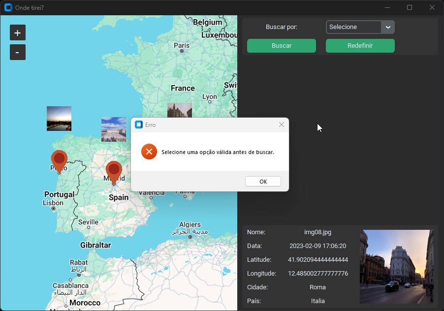

# Onde tirei?

O projeto tem como objetivo implementar um programa orientado a objetos capaz de processar dados geoespaciais de imagens e prover uma visualização destes dados em uma interface gráfica contendo um mapa interativo.

## Funcionalidades

- **Visualização Geoespacial**: Permite visualizar a localização de cada imagem no mapa.
- **Detalhes da Imagem**: Exibe detalhes das imagens, fornecendo informações relevantes.
- **Filtro de Busca**: Possui um filtro de busca para exibir no mapa apenas as imagens que atendem aos critérios especificados.
- **Interface Gráfica Amigável**: Desenvolvida utilizando Tkinter, CustomTkinter e tkintermapview para uma experiência de usuário intuitiva.
- **Tratamento de Erros na Busca**: Implementa notificações de erros para melhorar a experiência do usuário e impedir buscas inválidas.

## Tecnologias Utilizadas

- **Tkinter**: Utilizado para a construção da interface gráfica.
- **CustomTkinter**: Aprimoramento personalizado do Tkinter para atender às necessidades específicas do projeto.
- **TkinterMapView**: Integrado para proporcionar funcionalidades de mapa interativo.

## Capturas de tela

- Detalhes da imagem:

- Mensagens de erro:

## Diagrama de classes
